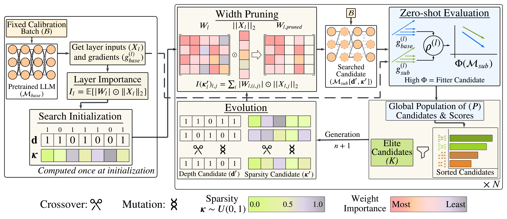
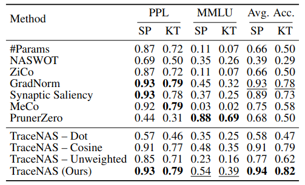
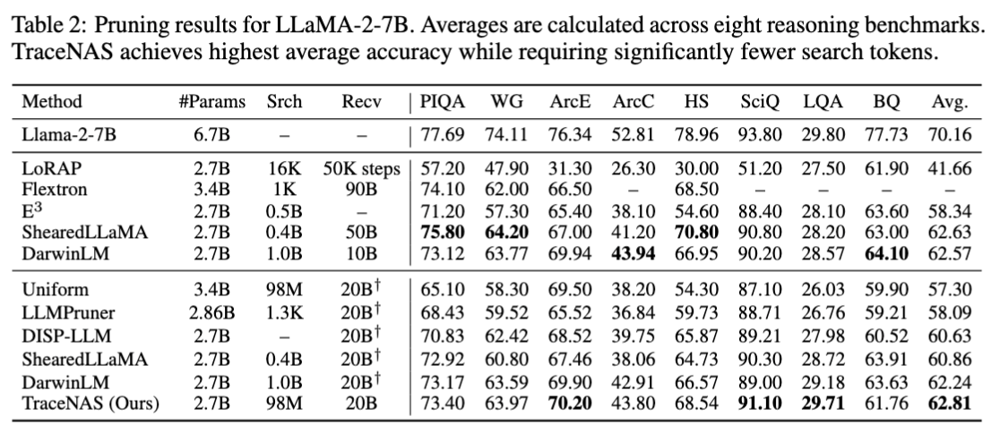

<p align="center">
  
</p>
This repository contains the code for <i><b>TraceNAS: Zero-shot LLM Pruning via Gradient Trace Correlation</b></i>. 

# Summary
TraceNAS is a training-free Neural Architecture Search (NAS) framework designed for the efficient structured pruning of LLMs. By jointly optimizing for depth and width using a <i><b>novel</b></i> scale-invariant zero-shot proxy, TraceNAS identifies pruned models that maintain high performance potential without the massive computational overhead of training-aware methods.


# Overview of TraceNAS Search Framework
<p align="center">
  
</p>
TraceNAS implements a gradient-based, training-free proxy designed to guide structural pruning efficiently. The framework operates through a precise, three-stage pipeline:

### 1. Initialization
The process begins with a one-time setup to establish the baseline for the search space:
* **Base Gradient Traces ($g_{\text{base}}$):** Captured to represent the full model's functional state.
* **Importance Scores ($I_l$):** Calculated to determine the relative contribution of individual layers.

### 2. Evolutionary Search
A population of architectural candidates, defined by depth ($\mathbf{d}$) and width ($\boldsymbol{\kappa}$), undergoes iterative evolution:
* **Genetic Operators:** Utilizes crossover and mutation to explore the design space.
* **Width Realization:** Each width configuration is implemented using an $O(d^2)$ activation-weighted heuristic (WANDA), ensuring efficient importance-based sub-network search.

### 3. Zero-Shot Ranking
Candidates $M_{sub}$ are evaluated without training using the **Zero-Shot Proxy ($\Phi$)**. This proxy ranks architectures by measuring the **gradient trace alignment** between the active layers of the sub-network and the original base model $M_{base}$.

# Quantitative Results
## TraceNAS Correlation with Perplexity(PPL) and Accuracy
<p align="center">
  
</p>
Correlation of zero-shot proxies with model performance calculated over 70 pruned models and averaged over 3 seeds. We report Spearman Rho (SP) and Kendall Tau (KT) for perplexity
(PPL), MMLU and average commonsense reasoning accuracies. Best correlation values per column are bolded and underlined values denote the second best correlation.

## Comparative results with other search-based pruning methods
<p align="center">
  
</p>
Pruning results for LLaMA-2-7B. Averages are calculated across eight reasoning benchmarks. TraceNAS achieves the highest average accuracy while requiring significantly fewer search tokens.

# Quick Start
## 1. Installation
After cloning the repository, install environmental dependencies via Conda (Anaconda, Miniconda, etc.). The new conda environment will have the name `tracenas`.
```bash
conda env create -f environment.yml
```

## 2. Datasets
This search for pruned LLMs and Continued Pre-trainign are carried out on the `FineWeb-Edu sample-100BT` dataset. The dataset is loaded to your specified path via the first run of the search. You can use the streamed version of this FineWeb-Edu if required. Note that this will make the architecture search much longer. 

## 3. Usage
> Note: You need to provide the path to your models and the calibration dataset. 
### 3.1 Run Search
```bash
./scripts/run_search.sh
```

> Note: The script is mostly self contained with seach hyperparameters for each model.  

### 3.2 Run Continued Pretraining of Pruned Models
+ CPT of pruned Llama2-7B
```bash
./scripts/cpt_llama2.sh
```

+ CPT of pruned Llama3.1-8B
```bash
./scripts/cpt_llama3.1.sh
```

+ CPT of pruned Qwen2.5-14B
```bash
./scripts/cpt_qwen2.5.sh
```
> Note: You may need to change the path to the searched models before running. 

### 3.3 Evaluate Models
+ Evaluate the base model
```bash
./scripts/eval_base_model.sh
```

+ Evaluate the trained pruned models
```bash
./scripts/eval_pruned_model.sh
```

# Acknowledgments
We acknowledge the following works for their contributions to the development of TraceNAS:
[WANDA](https://github.com/locuslab/wanda),
[AmoebaLLM](https://github.com/GATECH-EIC/AmoebaLLM)
